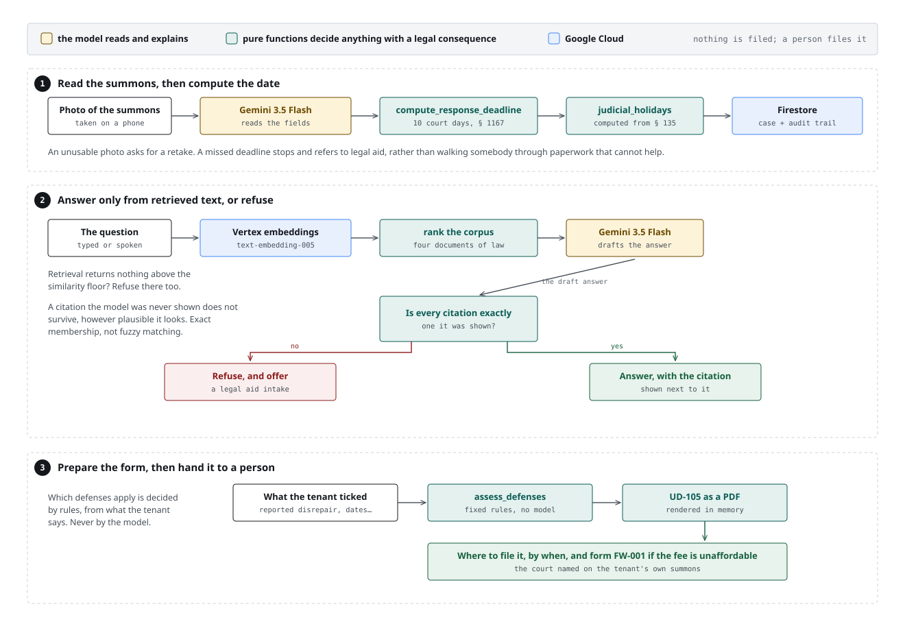
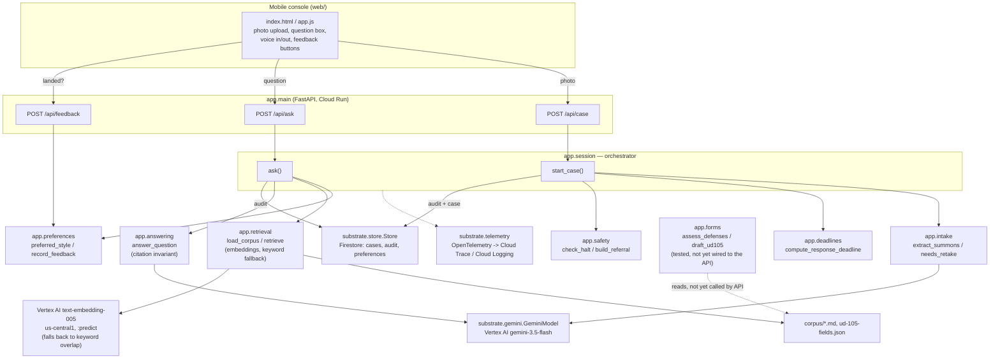

# Architecture

## Diagram

## Components

**`web/`** — A framework-free, mobile-first HTML/CSS/JS console. It uploads a
summons photo, sends questions, plays answers back with the Web Speech API
(falling back to the always-visible typed text when speech isn't available
or supported), and reports whether an explanation landed. It carries no
business logic — every decision it displays came back from the API as
already-computed text or data.

**`app.main`** — The FastAPI application. Wires three endpoints
(`POST /api/case`, `POST /api/ask`, `POST /api/feedback`) and the static
console (`GET /`) onto `substrate.web.create_app`'s base app (which also
supplies `/healthz` and `/events`, unused by this project's own request
path). Builds one `Store` and constructs a `GeminiModel` per request rather
than at import time. Telemetry setup is gated on `USE_FAKE_STORE` so the
module can be imported in a test process with no GCP credentials at all.

**`app.session`** — The orchestrator. `start_case` runs a summons photo
through extraction, retake-or-not, deadline computation, and halt-or-not, in
that order, writing each step to the per-user audit trail as it goes.
`ask` looks up the user's preferred explanation style *before* generating
(so the preference actually reaches the model, not just the reply label),
retrieves relevant passages, and returns a grounded-or-refused answer. Both
functions guard every point where a model's reply — even one that looks
well-formed — could be missing a field or carrying a value the rest of the
pipeline doesn't recognize; see [Halt-and-route conditions](#halt-and-route-conditions)
and the retake path below.

**`app.intake`** — Turns a photograph into `SummonsFields` via one vision
call. Never guesses: an unparseable reply, a non-numeric confidence, or an
unrecognized service-method string all degrade to `None` / zero-confidence
fields rather than raising or fabricating a value. `needs_retake` decides
whether what came back is usable enough to proceed.

**`app.deadlines`** — Pure date arithmetic implementing Cal. Code Civ. Proc.
§ 1167: 10 *court* days (weekends and holidays excluded) from the day
service was legally complete, which service method shifts (personal:
immediate; substituted: +10 days; mail: +5 days). Deliberately has no
dependency on the model, the store, or the network — it is a pure function
of `(served_on, method, holidays) -> date`, and is covered by a battery of
tests across every branch and edge (mutation-checked, per the batch
constraints this build operated under).

**`app.safety`** — `check_halt` evaluates a fixed, ordered set of
conditions against the case and today's date; `build_referral` assembles
everything already known about the case into an intake packet, so a tenant
who is routed to a human doesn't have to repeat themselves under time
pressure. See [Halt-and-route conditions](#halt-and-route-conditions).

**`app.retrieval`** — Loads the curated corpus (`corpus/*.md`, front matter
parsed for `citation` and `topic`) and ranks passages against a question by
cosine similarity over Vertex `text-embedding-005` (768 dims, us-central1,
called against the `:predict` endpoint — this model is not on the newer
`embedContent` surface). Passage embeddings are cached process-wide
(`_PASSAGE_EMBEDDING_CACHE`); the corpus is four documents, so re-embedding
them on every question would be waste. If the embedding backend is
unavailable for any reason — no credentials, a network failure, a malformed
response — `retrieve()` falls back to the original stopword-filtered
token-overlap scorer (`_retrieve_by_keyword`) rather than raising, which is
also what keeps this project's test suite running unmocked and fast: there
is no ADC in this build's local/CI environment, so every existing test
exercises the fallback for real.

Two guards sit on top of the embedding ranking, both chosen from a real
measurement against this corpus rather than picked in the abstract:

- **`SIMILARITY_FLOOR` (0.40)** — if the best-scoring passage is below this,
  `retrieve()` returns nothing, the same as the keyword scorer finding zero
  overlap, so `app.answering`'s existing refusal path fires.
- **`AMBIGUITY_MARGIN` (0.02)** — passages scoring within this of the top are
  a group the ranking cannot separate. They are returned *together*, and
  `retrieve()`'s `limit` may not cut through the group (`_top_passages`).
  The margin does **not** refuse; the floor is the only refusal in
  retrieval. It used to refuse, and that was a design error — see below.

The guards were sized against this measured table (Vertex
`text-embedding-005`, this corpus):

| query | deadline passage | defenses passage | correct passage | naive top-1 |
|---|---|---|---|---|
| "how many days do I have to respond" | 0.6259 | 0.5376 | deadline | correct |
| "what defenses can I raise" | 0.3924 | 0.5318 | defenses | correct |
| "my landlord never fixed the heating" | 0.4539 | 0.5824 | defenses | correct |
| "how long before they kick me out" | 0.4571 | 0.4573 | — | **wrong, by 0.0002** |

Embeddings alone get the first three right — including the heating question,
which the old keyword scorer answered with *nothing* (zero token overlap) and
so wrongly refused. The fourth is a near-tie a naive top-1 ranker would
answer confidently and incorrectly. `SIMILARITY_FLOOR` (0.40) sits at the
midpoint between the one measured off-topic score (an unrelated control
sentence scored 0.3303 against the deadline passage) and the lowest measured
on-topic top score (0.4573).

`AMBIGUITY_MARGIN` originally *refused* on that fourth row. Measured against
the deployed service, that refusal fired on every plain-English phrasing of
the product's central question — "how long do I have to respond" (§ 1167
0.6373 vs the service-methods passage 0.6381), "what is the deadline to file
my answer" (0.6462 / 0.6481), "How many days do I have to respond?" (0.6839 /
0.6665) — because the two tied passages were *both relevant*: one gives five
court days, the other gives when the clock starts. A near-tie now widens the
context instead of refusing. This cannot loosen the citation invariant:
`app.answering` checks every returned citation for exact membership in the
passages it was given, so an extra passage can only ever yield a real
citation. Full measurement table and reasoning in README, "Retrieval".

**`app.answering`** — Where the citation invariant lives (below). Takes a
question and the retrieved passages, asks the model to answer using *only*
that material, and accepts the reply only if every citation in it is an
exact, verbatim match against a citation already present in the retrieved
passages. The user's preferred explanation style (plain / analogy /
stepwise) is folded into the same prompt via `STYLE_GUIDANCE`.

**`app.preferences`** — A per-user, per-style running score in Firestore.
`record_feedback` increments or decrements a style's score; `preferred_style`
returns whichever style has the highest positive score, defaulting to
`"plain"` for a new user or a style that has never had a net-positive
outcome. This is read by `app.session.ask` before every generation call, not
just reported afterward.

**`app.forms`** — A deterministic, rules-based affirmative-defense assessor
(`assess_defenses`) and a PDF renderer (`draft_ud105`) for Judicial Council
form UD-105. Defense selection is intentionally **not** model-generated: a
hallucinated affirmative defense in a filed Answer is the worst failure this
product could have, so it is a pure function of user-reported facts,
independently testable and auditable. Fully implemented and tested; not yet
called from `app.main` (see the README's Known Limitations).

**`substrate/`** — Vendored, shared infrastructure (not modified in this
project): `Store` (a Firestore wrapper with PII redaction and a
transactional audit-trail append), `GeminiModel` (the Vertex adapter, with
image MIME sniffing and empty-response guards), `telemetry` (OpenTelemetry
setup plus structured JSON logging), `web.create_app` (a Pub/Sub-push-safe
FastAPI factory), and `fakes` (in-memory stand-ins used by every test in
this project — no test in the suite touches a network or a real credential).

## The citation invariant

`app.answering.answer_question(model, question, passages, style)`:

1. Refuses immediately if no passages were retrieved for the question — an
   unanswerable question is never sent to the model to answer from nothing.
2. Sends the model *only* the retrieved passage text and citations, never
   the full corpus, and instructs it to answer using only that material.
3. Parses the reply defensively: unparseable JSON, JSON that parses to
   something other than an object, a missing or non-list `citations` field,
   a non-string item inside it, or a non-string `text` field are all treated
   identically — the answer is discarded and replaced with a fixed refusal.
4. Checks `set(citations) <= {p.citation for p in passages}` — **exact set
   membership, not fuzzy matching.** A citation that is a strict prefix of a
   real one, or wrapped in extra punctuation, is rejected exactly like a
   fabricated one. One fabricated or unverifiable citation among several
   real ones discards the whole answer, not just the bad citation.
5. Only if every check passes does the grounded answer (with its citations)
   reach the user; otherwise a fixed, non-model-generated refusal text is
   returned, which offers to prepare a legal-aid intake.

This is exercised by an intentionally adversarial test file
(`tests/test_answering.py`, 16 tests) covering fabricated citations,
prefix-only matches, a citations value that is a bare string (which Python
would otherwise happily iterate character-by-character), non-string items
mixed into an otherwise-valid list, and syntactically-valid JSON that isn't
an object at all (a bare number, string, array, or `null`).

## Halt-and-route conditions

`app.safety.check_halt(case, today)` evaluates, in this fixed priority
order (a missed deadline always outranks everything else):

| Condition | Reason | Referral urgency |
|---|---|---|
| The computed deadline has already passed | `past_deadline` | `critical` |
| The tenant wants to counter-sue | `countersuit` | `high` |
| A habitability injury is reported | `injury` | `high` |
| The matter involves a criminal allegation | `criminal` | `high` |

Any one of these stops the automated flow entirely. `build_referral` then
assembles an intake packet from everything already known about the case
(case number, court, plaintiff, deadline, and any facts gathered) so a human
advocate can pick it up without the tenant re-explaining their situation
under time pressure. `app.session.start_case` also treats two *intake*
failure modes — an unusably low-confidence photo read, and a well-formed
reply naming a service method the system doesn't recognize — as a **retake**
request rather than a halt: those are asking the tenant to try again, not
routing them to a person.
